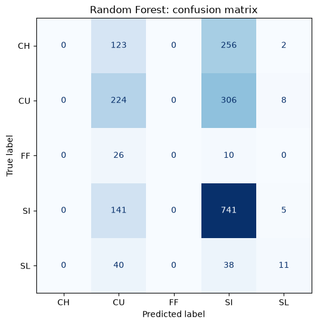
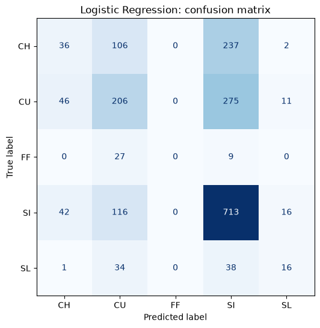
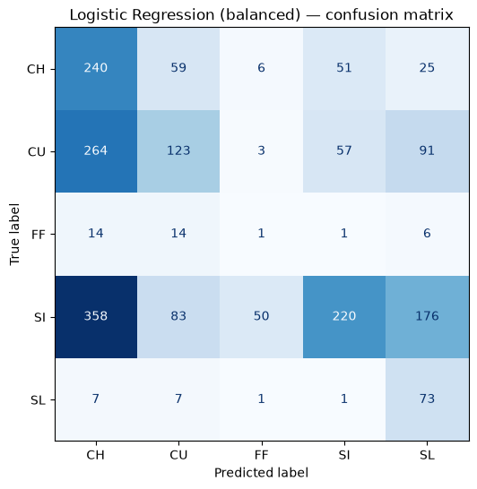

# mlb-pitch-predictor

Predicting Framber Valdez's next pitch type using Statcast data: comparing logistic regression, random forest, and HistGradientBoosting.

## Dataset

Pulled via `pybaseball`'s Statcast interface, covering every pitch Framber Valdez threw from 2019 through the in-progress 2026 season (~19,400 pitches after dropping unclassified pitches and pitch types under 2% usage, like his occasional cutter). Trained on 2019-2025, held out 2026 as validation (1,931 pitches). Pitch type distribution is uneven: sinker (SI) makes up about 46% of pitches, curveball (CU) 28%, changeup (CH) 20%, and slider (SL) and four-seam (FF) combined are under 7%.

## Approach

I started with a majority-class baseline (always predict sinker, since that's what he throws most) to get a real floor: 45.9% accuracy. Feature-wise, I built out sequence features (previous pitch, pitch two back, running share of pitch types thrown so far that game) and game-state features (count, runners on, platoon matchup, score differential), then compared logistic regression, random forest, and HistGradientBoosting against the baseline.

For cross-validation I used `TimeSeriesSplit` instead of regular k-fold, since pitch sequencing is temporal. A normal shuffled split would let the model peek at "future" at-bats while predicting "past" ones, which isn't a mistake I wanted baked into the tuning. GridSearchCV over logistic regression's `C` and `class_weight` picked light regularization (C=0.1) and, notably, `class_weight=None` over `balanced`. Balancing raised macro F1 only slightly (0.276 vs 0.289) while cutting raw accuracy nearly in half (34.0% vs 50.6%), so it wasn't actually surfacing more signal, just shifting where the model's mistakes landed.

## Results





| Model | Accuracy | Macro F1 |
|---|---|---|
| Dummy Baseline (majority class) | 45.9% | 0.126 |
| Logistic Regression | 50.3% | 0.289 |
| Random Forest | 50.5% | 0.253 |
| HistGradientBoosting | 50.0% | 0.275 |
| Logistic Regression (balanced) | 34.0% | 0.276 |
| **Logistic Regression (tuned)** | **50.6%** | **0.288** |

Per-class breakdown for the shipped model (tuned logistic regression, on the 2026 validation season):

| Pitch Type | Precision | Recall | F1 | Support |
|---|---|---|---|---|
| CH | 0.30 | 0.09 | 0.14 | 381 |
| CU | 0.43 | 0.39 | 0.41 | 538 |
| FF | 0.00 | 0.00 | 0.00 | 36 |
| SI | 0.56 | 0.81 | 0.66 | 887 |
| SL | 0.36 | 0.17 | 0.23 | 89 |

## Key Findings

- Logistic regression matched or beat both tree ensembles despite being the simplest model tried, which points to the added complexity of Random Forest and HistGradientBoosting not being worth it on a dataset this size for one pitcher.
- HistGradientBoosting showed the widest train/validation accuracy gap (0.143, vs. 0.060 for logistic regression). It was fitting noise in training rather than learning anything extra that generalized.
- The per-class report makes the sinker bias concrete: SI gets 0.81 recall, by far the best of any class, while the model never once correctly predicts a four-seam (0.00 precision and recall on 36 true FF pitches) and catches changeups only 9% of the time despite 381 examples in the validation set.
- Class-balancing the loss function changed where the model made mistakes more than it fixed the underlying problem. Accuracy dropped sharply for a marginal macro F1 gain, telling me the imbalance itself isn't the main bottleneck here.
- Overall ceiling: accuracy barely moved past the baseline (45.9% to 50.6%), but macro F1 nearly tripled (0.126 to 0.288). The model isn't predicting pitch selection much more often, but it's no longer just calling sinker on everything, aside from the four-seam it still never picks up.

## Limitations

This is a single-pitcher model trained on a fairly small dataset (~19k pitches across 7 seasons), so the rarer pitch types (four-seam, slider) have very few validation examples to be evaluated on reliably, and four-seam in particular has too little data for the model to learn it at all. The 2026 validation season is also still in progress at the time of writing, so it's a partial season rather than a clean, closed holdout. The feature set is limited to sequencing and game-state signals: no batter-specific tendencies, catcher framing, or pitch-location data, so there's a real ceiling on how well pitch type alone could ever be predicted from what's included here.

## Setup

```
pip install -r requirements.txt
```

## Testing a different pitcher

To run this analysis on a different pitcher, open `config.py` and update the following line:

```python
PITCHER_NAME = "Framber Valdez"
```

Replace the name with the pitcher you want to analyze, for example:

```python
PITCHER_NAME = "Zack Wheeler"
```

This is the only change required. All other scripts read the pitcher name from this config file, so the rest of the pipeline will automatically use the updated value.

## Running the pipeline

The scripts have sequential dependencies and must be run in the following order:

```
python config.py
python datapull.py
python features.py
python train.py
python eval.py
```

Each script's role in the pipeline is as follows:

1. `config.py` defines `PITCHER_NAME` and other shared settings used throughout the pipeline.
2. `datapull.py` pulls Statcast data for the configured pitcher using `pybaseball`.
3. `features.py` constructs the sequence and game-state features described above.
4. `train.py` trains and tunes the models (logistic regression, random forest, and HistGradientBoosting).
5. `eval.py` evaluates the trained model on the validation season and generates the confusion matrix figures.